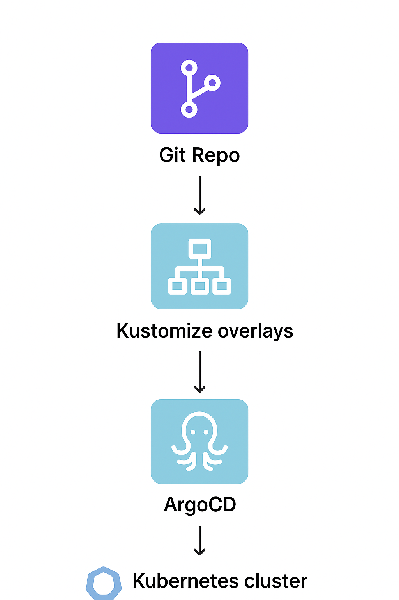

# ArgoCD + Kustomize Starter Repo

## Overview
This repo demonstrates deploying an Nginx app using Kustomize overlays and ArgoCD for GitOps.

## Repo structure 

argo-kustomize-starter/
├── base/
│   ├── deployment.yaml
│   ├── service.yaml
│   └── kustomization.yaml
├── overlays/
│   ├── dev/
│   │   ├── kustomization.yaml
│   │   └── replica-patch.yaml
│   ├── staging/
│   │   ├── kustomization.yaml
│   │   └── replica-patch.yaml
│   └── prod/
│       ├── kustomization.yaml
│       └── replica-patch.yaml
├── argo-app-dev.yaml
├── argo-app-staging.yaml
├── argo-app-prod.yaml
└── README.md

## Environments
- dev: 1 replica
- staging: 2 replicas
- prod: 3 replicas

## Usage
1. Install ArgoCD in your Kubernetes cluster.
2. Apply an ArgoCD Application:

```bash
kubectl apply -f argo-app-dev.yaml
kubectl apply -f argo-app-staging.yaml
kubectl apply -f argo-app-prod.yaml
```

3. Observe the app deployment in the ArgoCD UI or CLI.
4. Modify base or overlay configs in Git; ArgoCD will reconcile changes automatically.


GitOps Deployment with ArgoCD and Kustomize

# ArgoCD Kustomize Starter Project

This repository demonstrates a **GitOps workflow** using **ArgoCD** and **Kustomize** for managing Kubernetes deployments across multiple environments (dev, staging, prod).

---

## Table of Contents

- [Project Overview](#project-overview)  
- [Workflow Diagram](#workflow-diagram)  
- [Prerequisites](#prerequisites)  
- [Setup](#setup)  
- [Usage](#usage)  
- [GitOps Workflow](#gitops-workflow)  
- [Cleanup](#cleanup)  
- [References](#references)  

---

## Project Overview

This project shows how to:  

- Use **Kustomize overlays** for environment-specific configuration.  
- Deploy applications using **ArgoCD**.  
- Keep Kubernetes manifests in Git for automated deployments and rollbacks.  

Environments included:  

- `dev`  
- `staging`  
- `prod`  

---

## Workflow Diagram



**Workflow:**  
Git Repo (Kustomize overlays) → ArgoCD → Kubernetes Cluster

yaml
Copy code

---

## Prerequisites

- Docker  
- Kind (Kubernetes in Docker) or any Kubernetes cluster  
- kubectl  
- ArgoCD installed in the cluster  

---

## Setup

1. **Clone repository:**

```bash

git clone https://github.com/<your-org>/argo-kustomize-starter.git
cd argo-kustomize-starter
```

2. Create Kubernetes cluster (if not already running):

```bash

kind create cluster --name kind
kubectl cluster-info
```

3. nstall ArgoCD:

```bash

kubectl create namespace argocd
kubectl apply -n argocd -f https://raw.githubusercontent.com/argoproj/argo-cd/stable/manifests/install.yaml
```

4. Access ArgoCD UI:

```bash

kubectl port-forward svc/argocd-server -n argocd 8080:443
```

Open your browser: **https://localhost:8080**

# Usage

# Apply Application Manifests

```bash

kubectl apply -f argo-app-dev.yaml
kubectl apply -f argo-app-staging.yaml
kubectl apply -f argo-app-prod.yaml
```

# View Applications in ArgoCD UI
- Sync manually or enable automated sync.
- Monitor application health and sync status.

# Port-Forward Example for Nginx App

```bash

kubectl port-forward svc/nginx-app-dev 8081:80 -n default
kubectl port-forward svc/nginx-app-staging 8082:80 -n default
kubectl port-forward svc/nginx-app-prod 8083:80 -n default
```

Access in browser:

- Dev: **http://localhost:8081**
- Staging: **http://localhost:8082**
- Prod: **http://localhost:8083**

# GitOps Workflow
1. Edit Kustomize base or overlay (e.g., change replicas in **overlays/dev/replica-patch.yaml**):

```yaml

spec:
  replicas: 2
``` 
2. Commit and push changes:

```bash

git add overlays/dev/replica-patch.yaml
git commit -m "Increase dev replicas to 2"
git push
```

3. ArgoCD detects the change and synchronizes the cluster automatically.

##  Cleanup

Stop your cluster when not in use:

```bash

kind delete cluster
```

# References
- [ArgoCD Documentation](https://argo-cd.readthedocs.io/en/stable/)
- [Kustomize Documentation](https://kubectl.docs.kubernetes.io/references/kustomize/)
- [Kubernetes Documentation](https://kubernetes.io/docs/)

# Quick Cheat Sheet

---
| Task                               | Command/Action                                              |
| ---------------------------------- | ----------------------------------------------------------- |
| Create kind cluster                | `kind create cluster`                                       |
| Check nodes                        | `kubectl get nodes`                                         |
| Install ArgoCD                     | `kubectl apply -n argocd -f <manifest-url>`                 |
| Check ArgoCD pods                  | `kubectl get pods -n argocd`                                |
| Forward ArgoCD server to localhost | `kubectl port-forward svc/argocd-server -n argocd 8080:443` |
| Apply ArgoCD application           | `kubectl apply -f argo-app-dev.yaml`                        |
| Sync app via UI                    | Click **SYNC** in ArgoCD UI                                 |
| Check app status                   | `kubectl get applications -n argocd`                        |
| Edit Git manifests & push          | `git add . && git commit -m "msg" && git push`              |
| Delete cluster                     | `kind delete cluster`                                       |
---